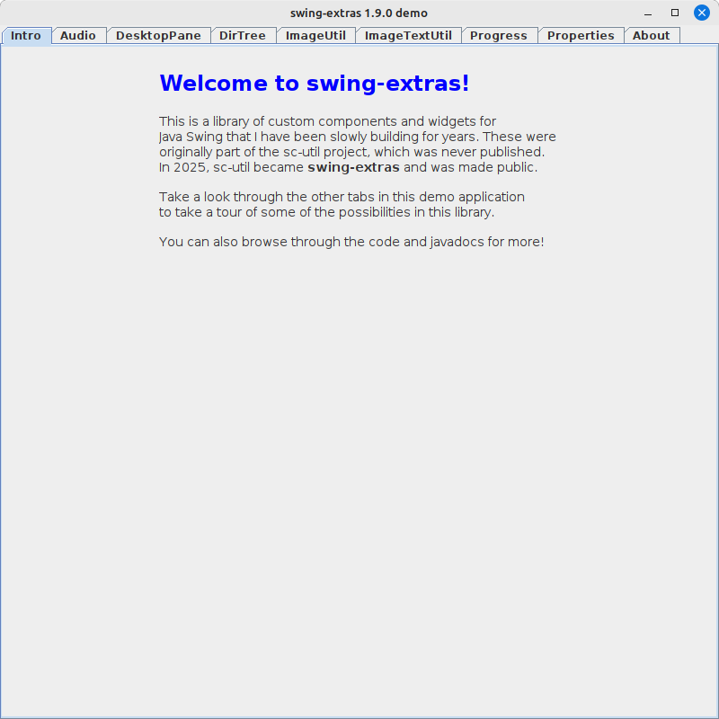

# swing-extras

This is swing-extras, a collection of custom components and utilities for Java Swing 
applications. I wrote this collection of code from around 2012 until around 2022, but
it was not publicly available until 2025. 

The library includes a demo application so you can try out the various components and
utilities within swing-extras:



## Relation to swing-forms

The `swing-extras` project builds on top of `swing-forms`: <https://github.com/scorbo2/swing-forms>

## Documentation

There are many features and utilities included! On this page you will find some of the
highlights, but you are encouraged to clone the project and generate javadocs from
it to explore all the nooks and crannies! 

**Highlights**:

- [Customizable About dialog](docs/about.md)
- [AudioWaveformPanel and AudioUtil](docs/audio.md)
- [DesktopPane](docs/desktoppane.md)
- [DirTree](docs/dirtree.md)
- [Image and Gradient utilities](docs/imageutil.md)
- [Progress utilities](docs/progress.md)
- [PropertiesManager](docs/properties.md)

## How do I get it?

If you're using Maven, you can simply list it as a dependency:

```xml
<dependencies>
  <dependency>
    <groupId>ca.corbett</groupId>
    <artifactId>swing-extras</artifactId>
    <version>1.9.0</version>
  </dependency>
</dependencies>
```

If you want to run the demo app, or if you want to play with the code locally,
for example to generate the javadocs locally, then you can clone the repo:

```shell
git clone https://github.com/scorbo2/swing-extras.git
cd swing-extras
mvn package
java -jar target/swing-extras-1.9.0-jar-with-dependencies.jar
```

## License

swing-extras is made available under the MIT license: https://opensource.org/license/mit

## Revision history

The swing-extras library came together slowly as part of various side projects from around 2012
until around 2023, but was not made available on github until recently. Version `1.9.0` 
is the first publicly available version of the library.
