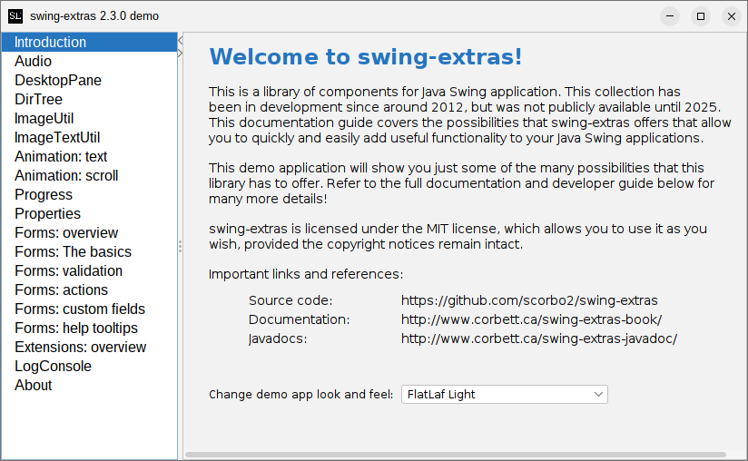

# swing-extras

This is swing-extras, a collection of custom components and utilities for Java Swing 
applications. I wrote this collection of code from around 2012 until around 2022, but
it was not publicly available until 2025. 

The library includes a demo application so you can try out the various components and
utilities within swing-extras:



## Documentation

You can browse the full documentation online:
- <http://www.corbett.ca/swing-extras-book/>
- The [javadocs](http://www.corbett.ca/swing-extras-javadocs/2.3.0) are also available.

## How do I get it?

`swing-extras` is available in Maven Central, so you can simply list it as a dependency:

```xml
<dependencies>
  <dependency>
    <groupId>ca.corbett</groupId>
    <artifactId>swing-extras</artifactId>
    <version>2.3.0</version>
  </dependency>
</dependencies>
```

If you want to run the demo app, or if you want to play with the code locally,
for example to generate the javadocs locally, then you can clone the repo:

```shell
git clone https://github.com/scorbo2/swing-extras.git
cd swing-extras
mvn package
java -jar target/swing-extras-2.3.0-jar-with-dependencies.jar # Runs the built-in demo app
```

## License

swing-extras is made available under the MIT license: https://opensource.org/license/mit

## Revision history

The swing-extras library came together slowly as part of various side projects from around 2012
until around 2023, but was not made available on GitHub until recently. Version `1.9.0` 
was the first publicly available version of the library.

View the [full release notes and version history](src/main/resources/swing-extras/releaseNotes.txt)
