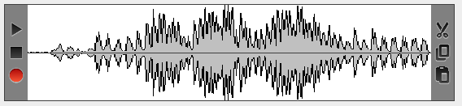
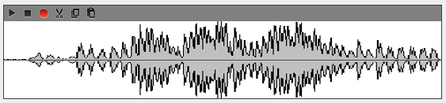
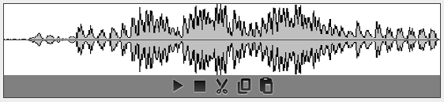
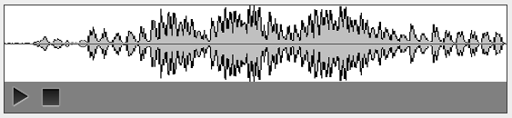
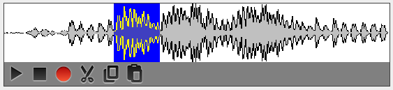
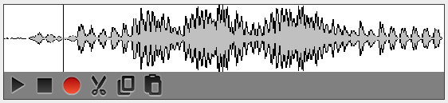
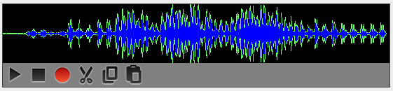

<-- [Back to swing-extras documentation overview](../README.md)

# Audio waveform display and AudioUtil

## Displaying an audio waveform and editing it

The `WaveformConfig` and `AudioWaveformPanel` classes allow you to
visualize an audio waveform and optionally give you controls to manipulate it:



The controls on the left allow you to play the current clip, stop playing, or
record a new clip to replace the clip currently being displayed. The controls on
the right allow you to cut, copy, or paste based on mouse selections you make
within the panel. The position and size of these controls are customizable:

```java
// Make the controls x-small and put them in top-left position:
audioWaveformPanel.setControlPanelPosition(ControlPanelPosition.TOP_LEFT);
audioWaveformPanel.setControlPanelSize(ControlPanelSize.XSMALL);
```



You also have the ability to disable recording within the panel, to force it to
be for playback only:

```java
// Make the controls normal size, put them bottom-center, and disable recording:
audioWaveformPanel.setControlPanelPosition(ControlPanelPosition.BOTTOM_CENTER);
audioWaveformPanel.setControlPanelSize(ControlPanelSize.NORMAL);
audioWaveformPanel.setRecordingAllowed(false);
```



And you can disable the cut/copy/paste functionality to make the panel truly
read-only:

```java
// Make the controls large in bottom-left, and truly read-only:
audioWaveformPanel.setControlPanelPosition(ControlPanelPosition.BOTTOM_LEFT);
audioWaveformPanel.setControlPanelSize(ControlPanelSize.LARGE);
audioWaveformPanel.setRecordingAllowed(false);
audioWaveformPanel.setEditingAllowed(false);
```



If editing is enabled, you can click and drag in the panel to select a portion
of the audio to be cut or copied:



And you can left click in the panel to set an insertion point for paste operations:



### Customizing the display

Of course, the default grey and black and white display may be a bit drab and boring.
Naturally, it's fully customizable, using the `WaveformConfig` class:

```java
WaveformConfig waveformConfig = new WaveformConfig();
waveformConfig.setBgColor(Color.BLACK);
waveformConfig.setFillColor(Color.BLUE);
waveformConfig.setOutlineColor(Color.GREEN);
audioWaveformPanel.setWaveformPreferences(waveformConfig);
```




## AudioUtil

AudioUtil is a set of wrapper methods around the `javax.sound` classes that make
it a bit easier to load, play, record, and save audio files. Sadly, Java does not
support mp3 audio without the use of a 3rd party library, so we are limited
to various lossless formats, most notably WAV.

The simplest way to use AudioUtil is to invoke one of the `play` methods:

```java
AudioUtil.play(new File("example.wav"), myPlaybackListener);
```

If recording is enabled in your `AudioWaveformPanel`, you can save the results
with the `saveAudioFile` method:

```java
AudioUtil.saveAudioFile(new File("my_recording.wav"), audioPanel.getAudioData());
```

There are various other utility methods in `AudioUtils` for working with audio clips
and extracting their data. For example, you can generate a waveform image
directly from an audio file without need an `AudioWaveformPanel`:

```java
BufferedImage img = AudioUtil.generateWaveform(wavFile, waveformConfig);
```

NOTE: if the input audio clip is very long, this may result in very wide images,
as by default `AudioUtil` does not limit the output image width. You can control
this with `setXLimit`:

```java
// Scale the waveform down so it will fit into 1024 horizontal pixels:
waveformConfig.setXLimit(1024);
```

You also have options for controlling the x and y scaling values that AudioUtil
will use when generating the resulting image, but this relies on knowing how much
audio data will be present in the input clip:

```java
waveformConfig.setXScale(4096); // default is 1024 but let's make it smaller
waveformConfig.setYScale(32); // default is 64 but let's make it taller
```

By adjusting `xLimit`, `xScale`, and `yScale`, you can create images of different
shapes and sizes to represent your audio data.
