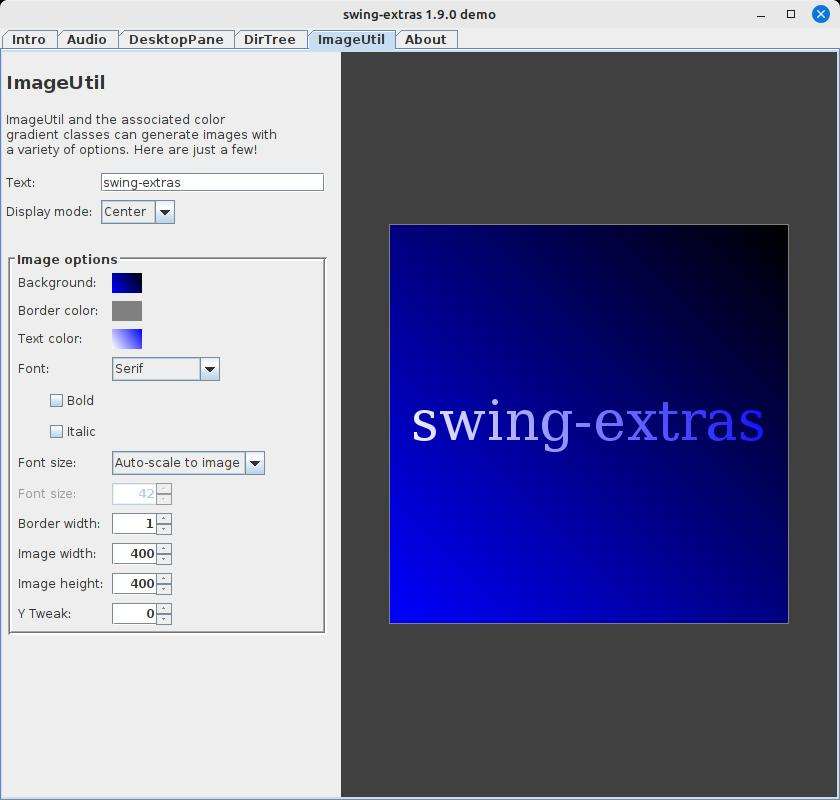
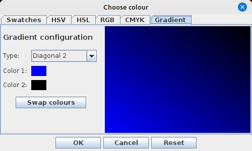

<-- [Back to swing-extras documentation overview](../README.md)

# ImageUtil and color gradients

The `ca.corbett.extras.image` and `ca.corbett.extras.gradient` packages contain
many neat options for generating and displaying images. The included demo
application gives a small tour of some of these features:

On the right side, we can see an example of `ImagePanel`, an extremely useful
component for displaying any type of image. ImagePanel offers options for
display, such as stretching or scaling, and can optionally allow zooming in
or out using the mouse wheel. 

On the left side, we can see an example of the `LogoConfigPanel`, useful
for using the `LogoGenerator` class to quickly and easily render images
with a single line of text. The LogoGenerator can make use of the
`GradientConfig` and `GradientUtil` classes to make the resulting image
more interesting.

`ImageUtil` also has easy wrapper methods to simplify loading and saving
images in any format supported by the JRE (png, jpeg, gif, etc). `ImageUtil`
and `ImagePanel` also support animated gif images!

It's worth mentioning that the `gradient` package also includes a custom
form field for configuring gradients, with an easy-to-use gradient
selection tool:

Color gradients can be used for an image background, or for text to be
overlaid on an image, or for image borders as well.

