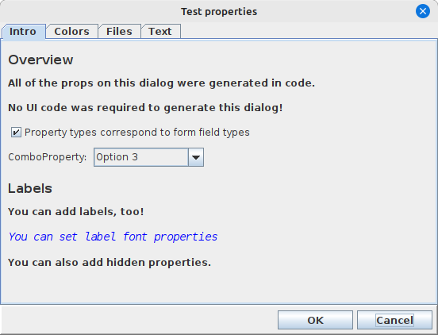

<-- [Back to swing-extras documentation overview](../README.md)

# PropertiesManager and PropertiesDialog

Every application wants to expose settings and preferences to the user so that the application
can be customized in appearance or behaviour. But why write the UI code for a preferences
dialog for each new application? Wouldn't it be nice if there was a way to easily specify
application properties in code, and have some way of auto-generating the UI for it?
Meet `PropertiesManager` and `PropertiesDialog`!



The code to specify application properties is VERY easy to set up and manage,
and the `PropertiesManager` handles the details of persisting those properties
for you so they can be reloaded on next application startup. But best of all,
there is no UI code required to generate a consistent properties dialog for
your new application, because `PropertiesDialog` can be generated dynamically
based on your list of properties!

Let's look at the code that sets up the properties in our test dialog seen above:

```java
private List<AbstractProperty> buildProps() {
    List<AbstractProperty> props = new ArrayList<>();

    // Simple label properties don't allow user input.
    // But, they can be handy for organizing and explaining the input form.
    props.add(new LabelProperty("Intro.Overview.label1", "All of the props on this dialog were generated in code."));
    props.add(new LabelProperty("Intro.Overview.label2", "No UI code was required to generate this dialog!"));

    // The available property types correspond to form field types in swing-forms!
    // That means we can do checkboxes and combo boxes and all the usual stuff:
    props.add(new BooleanProperty("Intro.Overview.checkbox1", "Property types correspond to form field types"));
    List<String> options = new ArrayList<>();
    options.add("Option 1");
    options.add("Option 2 (default)");
    options.add("Option 3");
    props.add(new ComboProperty("Intro.Overview.combo1", "ComboProperty:", options, 1, false));

    // Label styling options are available:
    props.add(new LabelProperty("Intro.Labels.someLabelProperty", "You can add labels, too!"));
    LabelProperty testLabel = new LabelProperty("Intro.Labels.someLabelProperty2", "You can set label font properties");
    testLabel.setFont(new Font("Monospaced", Font.ITALIC, 14));
    testLabel.setColor(Color.BLUE);
    props.add(testLabel);
    props.add(new LabelProperty("Intro.Labels.label3", "You can also add hidden properties."));

    // Color properties can accept solid colors, color gradients, or both:
    props.add(new ColorProperty("Colors.someSolidColor", "Solid color:", ColorProperty.ColorType.SOLID, Color.RED));
    props.add(new ColorProperty("Colors.someGradient", "Gradient:", ColorProperty.ColorType.GRADIENT));
    props.add(new ColorProperty("Colors.someMultiColor", "Both:", ColorProperty.ColorType.BOTH));

    // File properties can accept directories or files:
    props.add(new DirectoryProperty("Files.someDirProperty", "Directory:"));
    props.add(new FileProperty("Files.someFileProperty", "File:"));

    // Text properties can be single-line or multi-line:
    props.add(new TextProperty("Text.Single line.someTextProp1", "Text property1:", "hello"));
    props.add(new TextProperty("Text.Single line.someTextProp2", "Text property2:", ""));
    props.add(new TextProperty("Text.Multi line.someMultiLineTextProp", "Text entry:", "You can support long text as well.", 40, 4));

    // Properties can be "hidden".
    // They are readable and settable by the client application.
    // But they won't appear in the properties dialog!
    // This is great for application state like window size/dimensions and etc.
    IntegerProperty hiddenProp = new IntegerProperty("Hidden.someHiddenProp", "hiddenProp", 77);
    hiddenProp.setExposed(false);
    props.add(hiddenProp);

    return props;
}
```

Now that we have our list of properties defined for our fictional application,
we can fire up an instance of `PropertiesManager` to manage them for us:

```java
FileBasedProperties fileProps = new FileBasedProperties(new File("myapp.props"));
propsManager = new PropertiesManager(fileProps, buildProps(), "My Application settings");
```

We create an instance of `FileBasedProperties` to tell the manager where to persist
our properties. Then we hand our list of application properties. That's it! At any point
now, we can save or load our properties via `PropertiesManager`:

```java
// On startup:
propsManager.load();
```

## Generating a PropertiesDialog

Now the really easy part. We can ask `PropertiesManager` to generate a `PropertiesDialog`
for us and save us SO much manual UI code! 

```java
PropertiesDialog dialog = propsManager.generateDialog(myMainWindow, "App settings", isLeftAligned);
dialog.setVisible(true);
if (dialog.wasOkayed()) {
    propsManager.save();
}
```

That's it! No, really, that is it! Now your application has a consistent-looking
preferences dialog without any manual UI code!

But how do we organize the `PropertiesDialog` into tabs and categories?

## Ordering your properties

You may have noticed that each `AbstractProperty` created in our example above was
given a dot-separated internal name. This naming scheme is very handy for organizing
your properties visually for the user. 

The format of this fully qualified name is as follows:

  `[category.[subcategory.]]propertyName`

If category name is not specified, a default name of "General" will be used.    
If subcategory is not specified, a default name of "General" will be used 

Some examples:

- **UI.windowState** creates a property called "windowState" belonging to an
 implied subcategory of "General" within the "UI" category.
- **UI.window.state** creates a property called "state" in the subcategory
 of "window" within the top-level category of "UI".
- **windowState** - creates a property called "windowState" in an implied
top-level category of "General" with an implied subcategory of "General"
- **UI.window.state.isMaximized** - creates a property called "state.isMaximized"
 within the "window" subcategory in the "UI" top-level category. Note that further
 dots after the second one are basically ignored and are considered part of the
 property name. So, you can't have sub-sub-categories.

So, let's look a little closer at one of the properties we created earlier:

```java
new LabelProperty("Intro.Overview.label1", "All of the props on this dialog were generated in code.");
```

This creates a top-level category called "Intro" and a subcategory called "Overview".
The actual field name is called `label1`, and now `PropertiesDialog` knows where to
display it. Referring to our screenshot from above, we see that the top-level category
becomes a tab on the dialog, and the subcategory automatically gets a header label.
This simple naming convention allows you to organize what might otherwise be a long
flat list of properties. 

## Reading or changing properties via code at runtime

Your code will of course need to know the current values for the properties that
you have defined, and you may also want your application to be able to modify
those property values in code. You have a couple of options here: maintain properties in your own
code and refer to them directly as needed, or retrieve them dynamically from `PropertiesManager`.

### Option1: wrap PropertiesManager and maintain properties

Somewhere in your code you define a list of `AbstractProperty` instances for your application.
You can keep these handy for later reference:

```java
public class AppPreferences {
    private BooleanProperty someProperty;
    private PropertiesManager propsManager;

    // ... Singleton access ...

    public void load() {
        if (!propsManager == null) {
            propsManager = new PropertiesManager(PROPS_FILE, buildProps(), "MyApp");
        }
        propsManager.load();
    }

    public void save() {
        propsManager.save();
    }

    public boolean isSomePropertySet() {
        return someProperty.getValue();
    }
    
    public void setSomeProperty(boolean newValue) {
        someProperty.setValue(newValue);
    }
    
    public void showDialog() {
        PropertiesDialog dialog = new PropertiesDialog(myMainWindow, "Preferences", true);
        dialog.setVisible(true);
        if (dialog.wasOkayed()) {
            propsManager.save();
        }
    }
    
    private List<AbstractProperty> buildProps() {
        List<AbstractProperty> props = new ArrayList<>();
        someProperty = new BooleanProperty("checkbox1", "Some property");
        props.add(someProperty);
        return props;
    }
} 
```

Now we have added a wrapper around `PropertiesManager` that allows our application
some easy methods for programmatically viewing or changing our property values
(in this example, `isSomePropertySet` and `setSomeProperty`), along with an easy
way to generate and show the `PropertiesDialog`. By regenerating the `PropertiesDialog`
each time `showDialog` is invoked, we guarantee that `PropertiesManager` will supply
the latest value for our properties.

### Option 2: Just use PropertiesManager

If you don't like the thought of wrapping `PropertiesManager` like this, your other
option is to just use it directly. You can at any time request a property by its
fully-qualified name to inspect or change its value. The one drawback is that you
have to know the type of the property in question, so you can cast it:

```java
AbstractProperty prop = propsManager.getProperty("checkbox1");
((BooleanProperty)prop).setValue(true);
```

This approach requires perhaps a little less boilerplate, but you must cast each
call to `getProperty` to the right subtype of `AbstractProperty` in order to be able
to get or set its value. The advantage of this approach is that you don't have
to redundantly keep a handle on every property that you've supplied to `PropertiesManager`.
Up to you!
